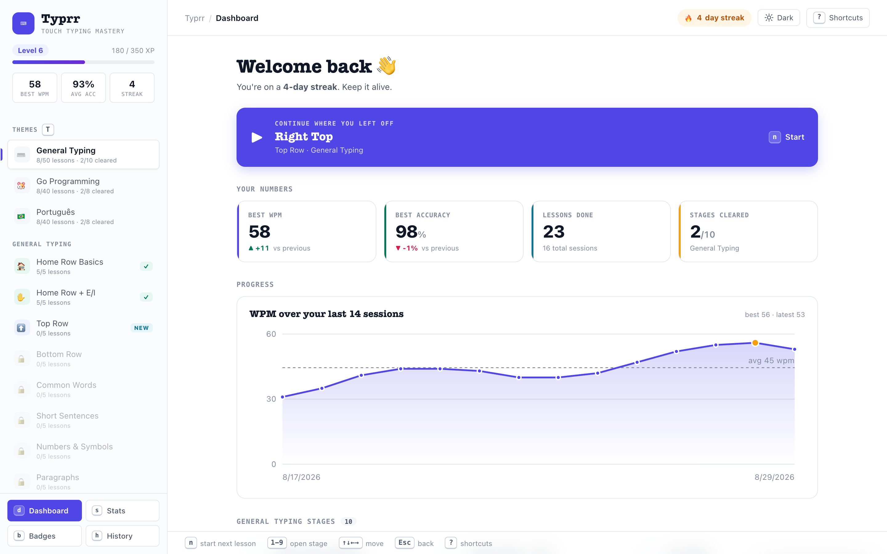
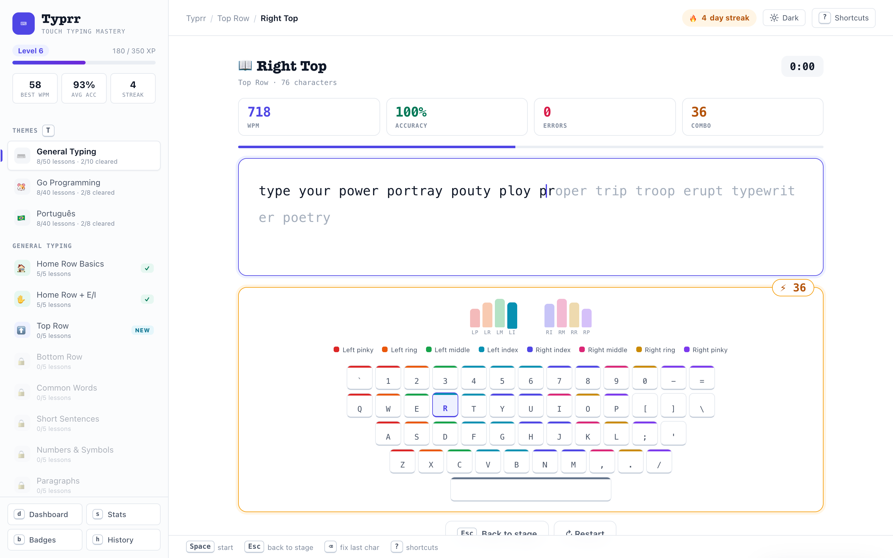
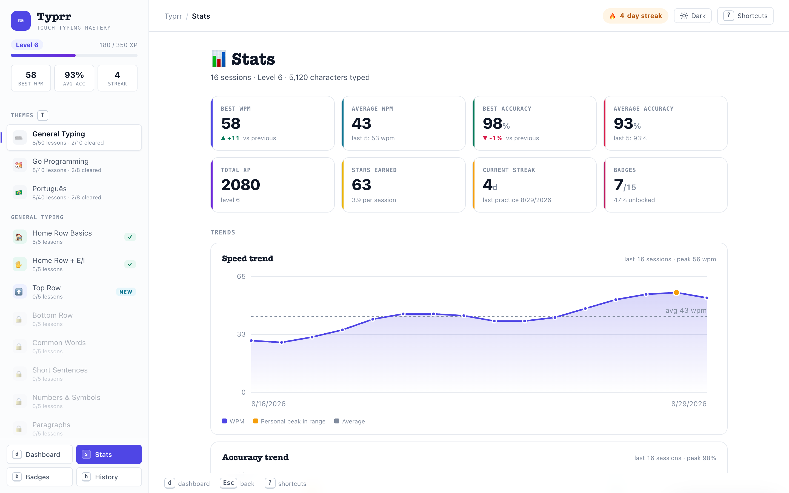
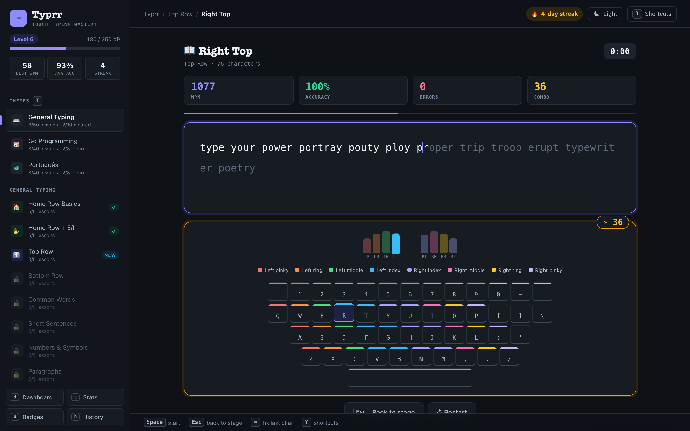

# Typrr

> Master touch typing with themed lessons, gamification, and daily practice.



## What is Typrr?

A standalone typing practice app — **zero dependencies, single HTML file**. Open `index.html` in any browser and start typing.

### Features

- **10 general typing stages** — from home row basics to professional speed
- **Go programming track** — muscle memory for `func`, `if err != nil`, goroutines, and real code
- **Portuguese track** — acentos, cedilha and dead-key input
- **5-minute lessons** — designed for daily practice
- **Finger guide** — colour-coded keyboard and live hand diagram show which finger to use
- **Gamification** — XP, levels, streaks, star ratings, 15 achievements
- **Stage tests** — must hit WPM + accuracy targets to unlock the next stage
- **Stats that mean something** — WPM/accuracy trend charts, 5-session deltas, an 18-week practice heatmap and your most-missed keys
- **Full keyboard control** — every screen is drivable without a mouse; press `?` for the shortcut sheet
- **Light and dark themes** — follows your OS by default, one click or `m` to override
- **Progress persistence** — everything saved in `localStorage`







## Quick Start

```bash
# Option 1: Just open it
open index.html

# Option 2: Local server
make serve          # http://localhost:8080
make serve PORT=3000
make stop
```

## Live Demo

**https://pedrolopesme.github.io/typrr/**

## Themes

| Theme | Stages | Focus |
|-------|--------|-------|
| **General Typing** | 10 | Home row → speed building → mastery |
| **Go Programming** | 8 | Keywords → functions → concurrency → real code |
| **Português** | 8 | Acentos, cedilha e texto corrido em português |

Each theme has 5 lessons per stage + a gated test.

## Keyboard Shortcuts

Press <kbd>?</kbd> anywhere for the full list.

| Key | Action |
|-----|--------|
| `d` `s` `b` `h` | Dashboard · Stats · Badges · History |
| `n` | Start the next recommended lesson |
| `t` / `Shift`+`t` | Cycle content themes |
| `m` | Toggle dark mode |
| `1`–`9` | Open the numbered card |
| `↑` `↓` `←` `→` | Move between cards (grid-aware) |
| `Space` | Start the typing session |
| `Esc` | Go back / dismiss |
| `1` `2` `3` | Post-session actions |

## Design

White-first and low-chrome: hairline-bordered cards on white, with saturated colour reserved for meaning — indigo for progress and focus, green for correct, red for errors, amber for streaks and tests.

Titles are set in a slab serif (`American Typewriter` → `Rockwell` → Georgia) for the typewriter voice, labels in letterspaced mono small caps, body in the system sans. All faces are already on your machine — no webfonts.

Dark mode is a pure token swap on `html[data-theme="dark"]`, resolved before first paint so it never flashes. See [design.md](design.md) for the full token reference.

## Project Structure

```
index.html      ← The entire app (HTML + CSS + JS)
design.md       ← Design system: tokens, states, data-viz rules
AGENTS.md       ← Conventions for AI agents
Makefile        ← Local server shortcuts
```

## Contributing

See [AGENTS.md](AGENTS.md) for architecture, data model, and coding conventions.

## License

MIT
